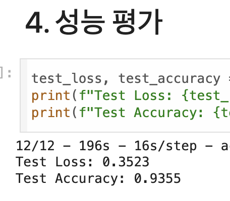
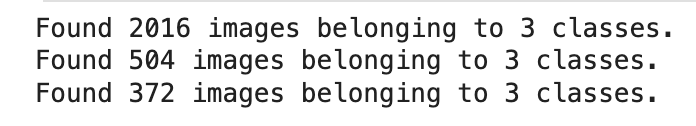
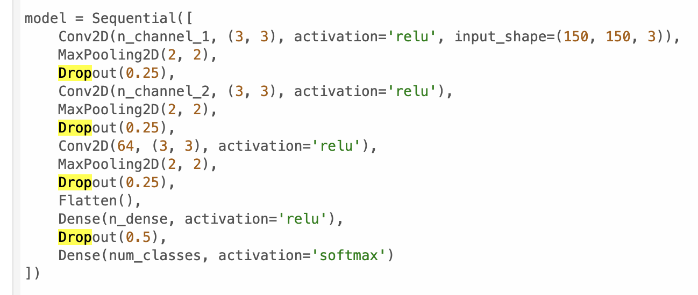
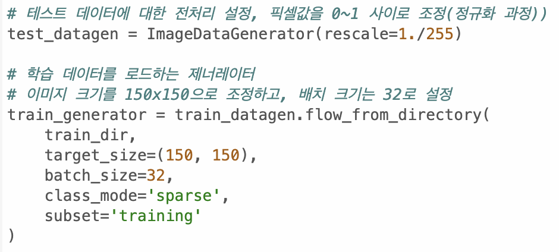
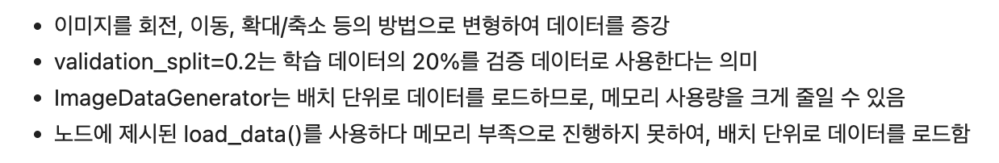
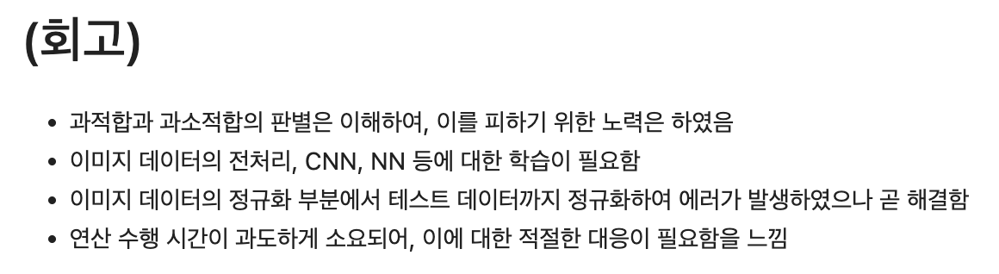
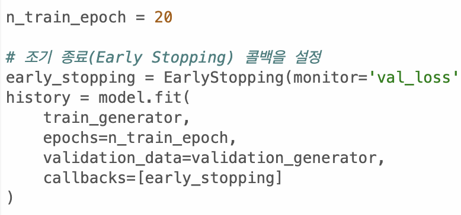

코더 : 이찬우

리뷰어 : 박윤희

---

🔑 **PRT(Peer Review Template)**

[O]  **1. 주어진 문제를 해결하는 완성된 코드가 제출되었나요?**
* 루브릭 3개 중 2.5개 이상 적합
  1. 이미지 분류기 모델이 성공적으로 만들어졌음 (학습 결과 시각화는 없음)
      &nbsp;&nbsp;&nbsp;&nbsp;&nbsp;&nbsp;&nbsp;
  2. 오버피팅 극복: 드롭아웃 적용, 데이터 개수를 늘림(2,520개)
      &nbsp;&nbsp;&nbsp;&nbsp;&nbsp;&nbsp;&nbsp;
      &nbsp;&nbsp;&nbsp;&nbsp;&nbsp;&nbsp;&nbsp;
  4. 분류모델 성능이 93%로 기준 이상 높게 나옴
      &nbsp;&nbsp;&nbsp;&nbsp;&nbsp;&nbsp;&nbsp;

 
    
[O]  **2. 전체 코드에서 가장 핵심적이거나 가장 복잡하고 이해하기 어려운 부분에 작성된 주석 또는 doc string을 보고 해당 코드가 잘 이해되었나요?**
 &nbsp;&nbsp;&nbsp;&nbsp;&nbsp;&nbsp;&nbsp;

 

[O]  **3. 에러가 난 부분을 디버깅하여 문제를 “해결한 기록"을 남겼거나 "새로운 시도 또는 추가 실험"을 수행해봤나요?**
 &nbsp;&nbsp;&nbsp;&nbsp;&nbsp;&nbsp;&nbsp;

 

[O]  **4. 회고를 잘 작성했나요?**
 &nbsp;&nbsp;&nbsp;&nbsp;&nbsp;&nbsp;&nbsp;

 

[O]  **5. 코드가 간결하고 효율적인가요?**
 &nbsp;&nbsp;&nbsp;&nbsp;&nbsp;&nbsp;&nbsp;
